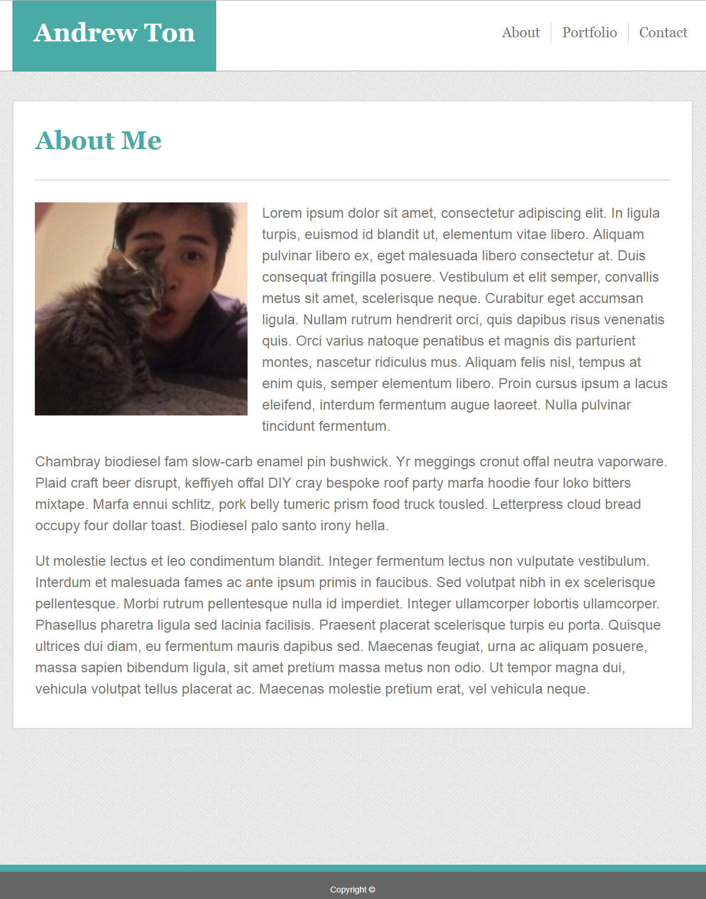
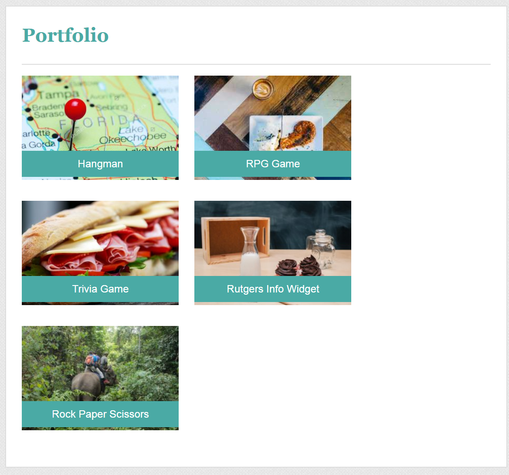

<!-- Put the name of the project after the # -->
<!-- the # means h1  -->
# HW-Basic-Portfolio

<!-- Put a description of what the project is -->
A basic portfolio site created using html and css.

# Link to deployed site
<!-- make a link to the deployed site --> 
<!-- [What the user will see](the link to the deployed site) -->
[GitHub Repository](https://github.com/atton88/Basic-Portfolio)

[Webite](https://atton88.github.io/Basic-Portfolio/)

# Images
<!-- take a picture of the image and add it into the readme  -->
<!--  -->



# technology used
<!-- make a list of technology used -->
<!-- what you used for this web app, like html css -->

<!-- 
1. First ordered list item
2. Another item
⋅⋅* Unordered sub-list. 
1. Actual numbers don't matter, just that it's a number
⋅⋅1. Ordered sub-list
4. And another item. 
-->

- HTML
- CSS

# code snippets
<!-- put snippets of code inside ``` ``` so it will look like code -->
<!-- if you want to put blockquotes use a > -->

Header
```
<header>
    <nav>
        <h1 class="whitetext bgteal"> Andrew Ton</h1>            
        <ul>
            <li class="lsdiv"> <a href="index.html">About</a></li>
            <li class="lsdiv"> <a href="portfolio.html">Portfolio</a></li>
            <li> <a href="contact.html">Contact</a></li>
        </ul>
    </nav>
</header>
```
Portfolio Panel
```
<div class="content">
    <div class="panel">
         </a>
        <div class="paneltxt bgteal whitetext">Hangman</div>
    </div>
```
Panel CSS
```
.panel {
    float: left;
    position: relative;
    padding-right: 30px;
    padding-bottom: 40px;
    height: 200px;
    width: 300px;
}

.paneltxt {
    box-sizing: border-box;
    position: absolute;
    top: 60%;
    left: 0;
    z-index: 1;
    width: 300px;
    text-align: center;
    padding: 10px;
}
```

# Learning points
<!-- Learning points where you would write what you thought was helpful -->
Learned basic website elements like headers, footers, panels, forms, and horizontal lists, as well as formatting the elements.

- floats
- box-sizing
- overflows
- classes
- forms
- horizontal lists
- position


# Author 
<!-- make a link to the deployed site and have your name as the link -->
[Andrew Ton](https://github.com/atton88)

# License
Standard MIT License